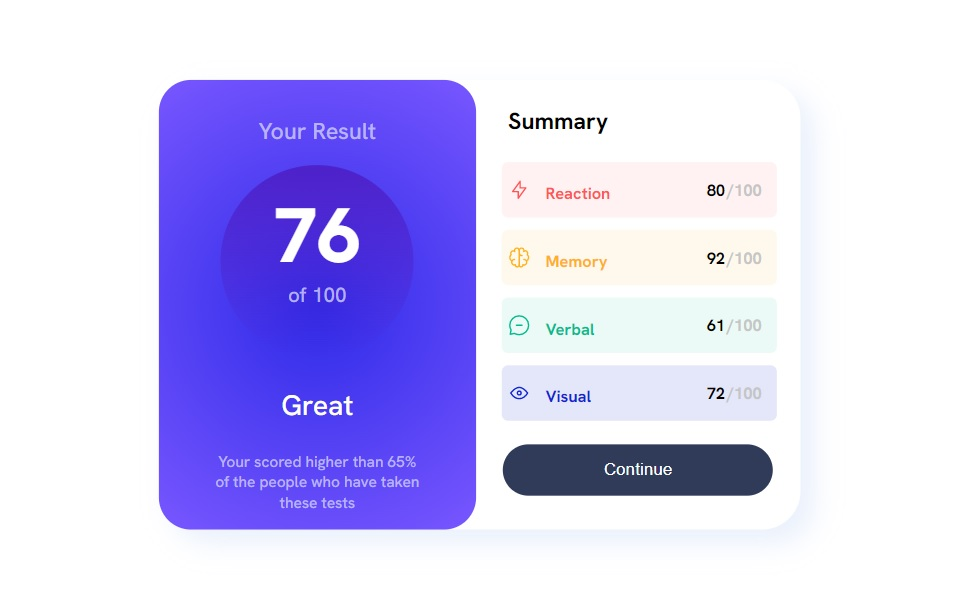
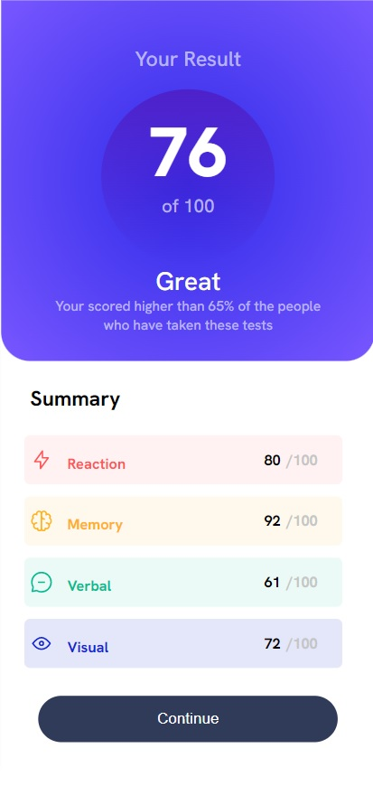

# Frontend Mentor - Results summary component solution

This is a solution to the [Results summary component challenge on Frontend Mentor](https://www.frontendmentor.io/challenges/results-summary-component-CE_K6s0maV). Frontend Mentor challenges help you improve your coding skills by building realistic projects. 

## Table of contents

- [Overview](#overview)
  - [The challenge](#the-challenge)
  - [Screenshot](#screenshot)
  - [Links](#links)
- [My process](#my-process)
  - [Built with](#built-with)
  - [What I learned](#what-i-learned)
  - [Continued development](#continued-development)
  - [Useful resources](#useful-resources)
- [Author](#author)
- [Acknowledgments](#acknowledgments)

## Overview

### The challenge

Users should be able to:

- View the optimal layout for the interface depending on their device's screen size
- See hover and focus states for all interactive elements on the page

### Screenshot






### Links

https://fdouglas27.github.io/frontendmentor/results-summary-component-main%20-%20newbie/

## My process

### Built with

- Semantic HTML5 markup
- CSS custom properties
- Flexbox
- CSS Grid
- Javascript


### What I learned

```js
for (let i = 0; i < data.length; i++) {
    console.log(data[i].category)
    console.log(data[i].score)
    console.log(data[i].icon)

    const productCard = document.createElement('div');
    productCard.classList.add('product-card');
    productCard.style.display = 'flex';
    productCard.style.margin = '10px 15px 0 20px';
    productCard.style.width = '85%';
    productCard.style.alignItems = 'center';
    productCard.style.borderRadius = '5px'
    productCard.style.gap = '4px';

    
    const imageScore = document.createElement('img');
    imageScore.setAttribute('src', data[i].icon);
    imageScore.style.margin = '0 0 0 5px';
    imageScore.style.width = '8%';
    
    const scoreName = document.createElement('p');
    
    scoreName.style.margin = '1rem 3.5rem 0.5rem 0.5rem';
    scoreName.style.width = '12%';
    scoreName.style.fontSize = '0.8rem'
    scoreName.style.fontWeight = '700'
    scoreName.style.marginBottom = '10px';

    const scoreDiv = document.createElement('div');

    const scoreValue = document.createElement('p');
    const scoreHundred = document.createElement('p');

    scoreValue.style.fontWeight = '700'
    scoreValue.style.margin = '0 0.7rem 0 0';
    scoreValue.style.width = '5%';
    scoreValue.style.fontSize = '0.8rem'
    scoreValue.innerText =`${data[i].score}`
    

    scoreName.innerText = data[i].category;
    scoreHundred.innerText = '/100';
    scoreHundred.style.width = '20%';
    scoreHundred.style.fontWeight = '700'
    scoreHundred.style.margin = '0 20px 0 0';
    scoreHundred.style.fontSize = '0.8rem'
    scoreHundred.style.color = 'rgba(195, 195, 195, 0.956)'; 

    if (i == 0) {
        productCard.style.backgroundColor = 'hsla(0, 100%, 67%, 0.080)';
        scoreName.style.color = 'hsl(0, 100%, 67%)';
    } else if (i == 1) {
        productCard.style.backgroundColor = 'hsl(39, 100%, 56%, 0.080)'
        scoreName.style.color = 'hsl(39, 100%, 56%)';
    } else if (i == 2) {
        productCard.style.backgroundColor = 'hsl(166, 100%, 37%, 0.080)'
        scoreName.style.color = 'hsl(166, 100%, 37%)';
    } else {
        productCard.style.backgroundColor = 'hsla(234, 85%, 45%, 0.112)'
        scoreName.style.color = 'hsla(234, 85%, 45%)';
    }

    scoreDiv.style.display = 'flex';
    scoreDiv.style.width = '80%';
    scoreDiv.style.justifyContent = 'end';

    scoreDiv.appendChild(scoreValue);
    scoreDiv.appendChild(scoreHundred);

    productCard.appendChild(imageScore);
    productCard.appendChild(scoreName);
    productCard.appendChild(scoreDiv);

    scoreContainer.appendChild(productCard);

}
```

### Continued development

I want to keep learning JS, and how it interacts with html and css.


### Useful resources

https://www.youtube.com/watch?v=Z92PqSyUBSI
https://developer.mozilla.org/es/docs/Web/CSS/box-shadow

## Author

- Frontend Mentor - [@fdouglas27](https://www.frontendmentor.io/profile/fdouglas27)


